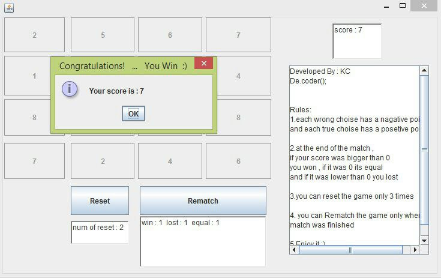

# Pair-Game
Pair game is a single player and reaching full score game. This game was my final project in the Advanced Programming Course in spring 2014 when I was in the 2nd semester. This game consists of a table that is filled with pair numbers in the random cells. if you find two same numbers in a different place then a specified score will be earned and it your selected cells do not matched then you lose score. I used Java Swing to build it's GUI.

|  | 
|:--:| 
| *a sample output* |
